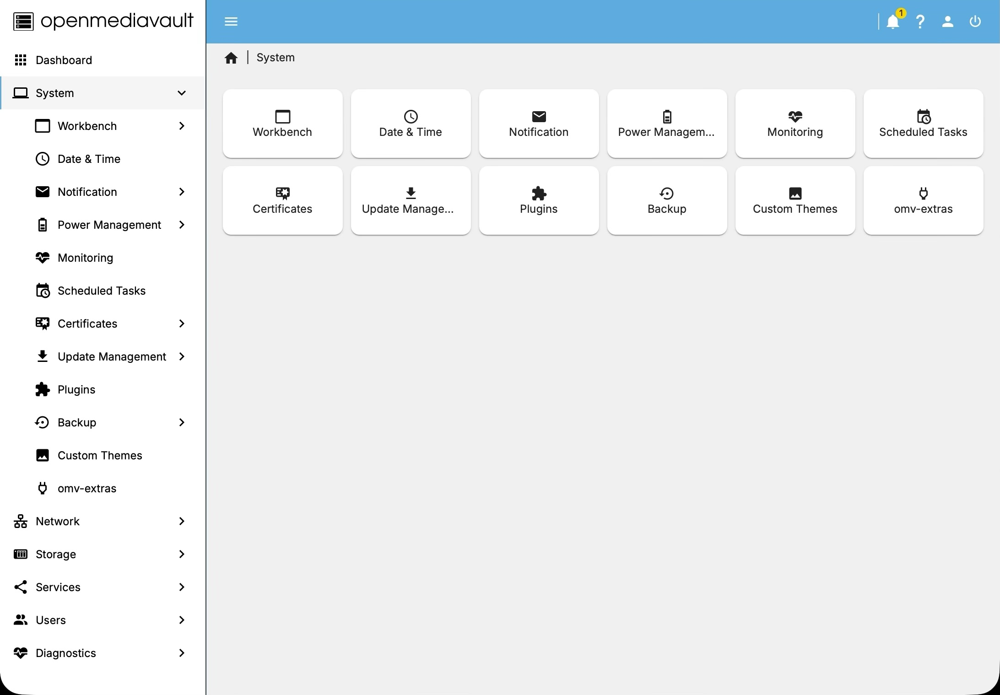
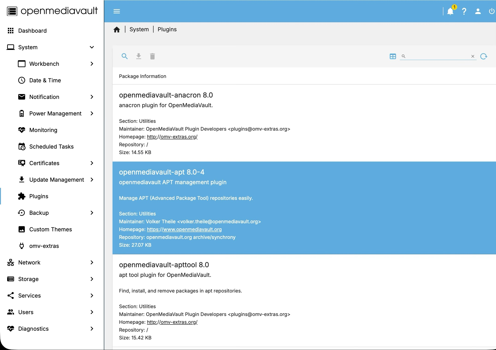
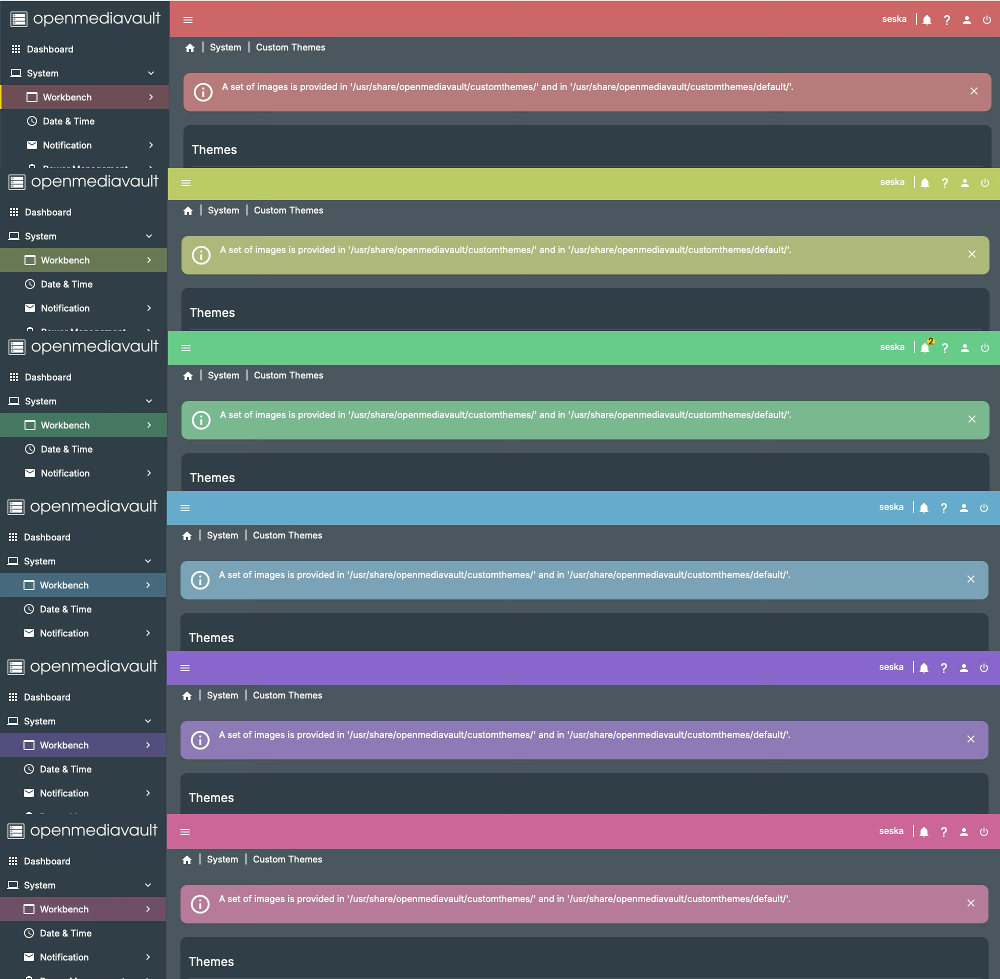
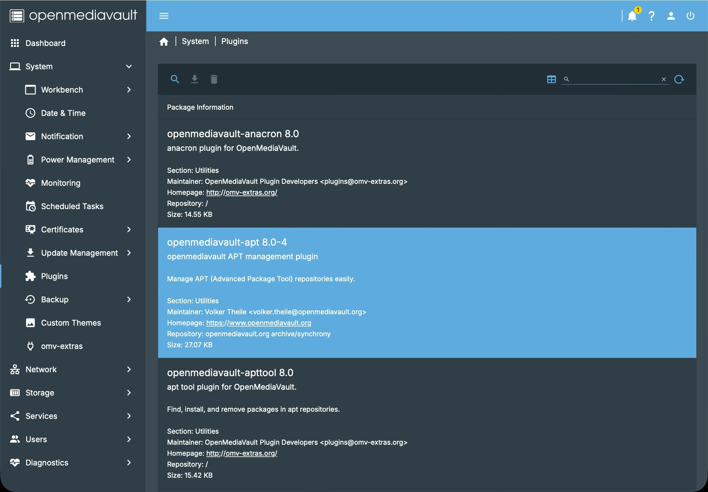

# Mode Themes

This plugin includes a new light mode theme and a slightly adjusted dark mode theme.

To activate a theme, simply enable the corresponding checkbox and reload the page.

## Light Mode Theme

## Dark Mode Theme

