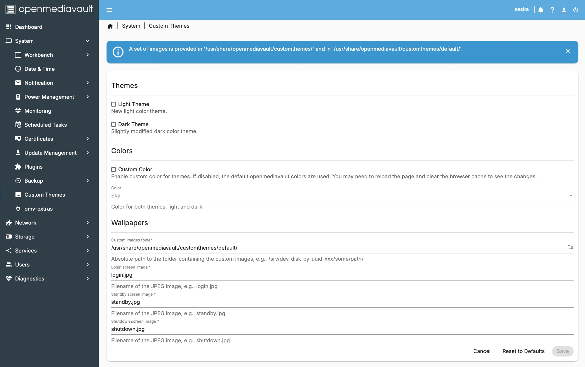

# openmediavault Custom Themes Plugin

A plugin for **openmediavault 8.1.1+** that allows you to set a new light mode theme, a slightly modified dark mode theme, colored accent colors and custom wallpapers for the login, standby, and shutdown screens.

The plugin uses an **APT hook** to ensure that your themes, colors and wallpapers remain applied even after openmediavault updates.

## Features

* Mode Themes for
  * Light Mode
  * Dark Mode

* Custom Colors
  * Red
  * Citrus
  * Lime
  * Sky
  * Plum
  * Rose

* Custom wallpapers for:
  * Login screen
  * Standby screen
  * Shutdown screen


* Persistent configuration using an APT hook (survives openmediavault updates)
* Includes default image set

## New Mode Themes and Custom Colors

[See here](Modes.md) for a quick look at the new mode themes 

## Images

A set of images is included in:

`/usr/share/openmediavault/customthemes`

The original images from **openmediavault 8.2.2** are available in:

`/usr/share/openmediavault/customthemes/default`

To use custom images, simply specify the desired file path.

New images should appear immediately. If they do not, clear your browser cache and reload the page.

## Installation

Download the `.deb` package from the **Releases** page and install it:

```
sudo dpkg -i <packagename.deb>
```

## Uninstall

To completely remove the plugin including configuration files and helper scripts, run:

```
sudo apt purge openmediavault-customthemes
```

Afterwards, reinstall openmediavault to restore the default themes, colors and images or wait for the next openmediavault update.
To reinstall openmediavault manually:

```
sudo apt reinstall openmediavault
```

## Screenshot

To give you an impression of the plugins UI:



## License

This project is licensed under the **MIT License**.

## Contributing

Bug reports, feature suggestions, and pull requests are welcome.

## Disclaimer

This plugin is provided **"as is"**, without warranty of any kind.

Always verify the results and keep backups of your original media.
